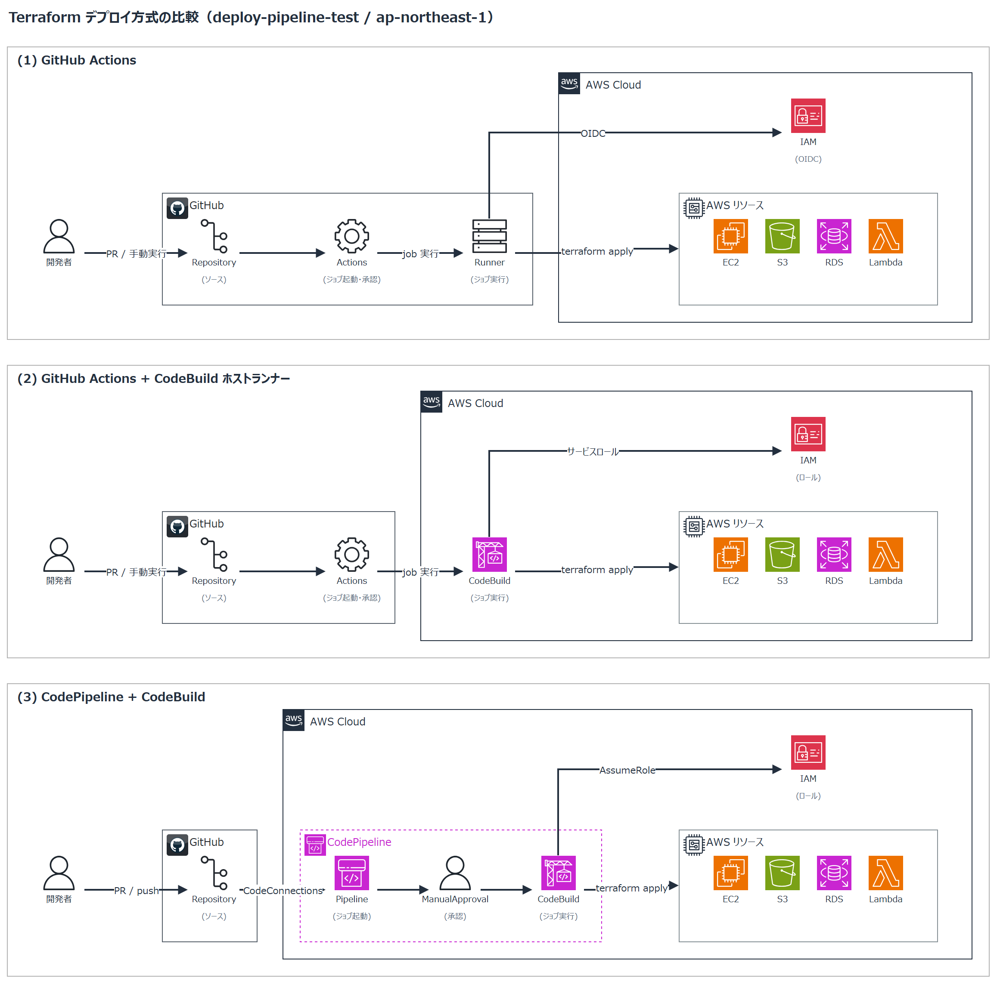

# deploy-pipeline

Terraform を用いた AWS リソースの CI/CD パイプライン実装サンプル。
3種類のデプロイ方式を比較・実装します。

## ディレクトリ構成

```
deploy-pipeline/
├── .github/workflows/
│   ├── terraform-<action>-github-runner.yml      # (1) GitHub Actions
│   └── terraform-<action>-codebuild-runner.yml   # (2) GitHub Actions + CodeBuild ホストランナー
│
├── terraform-pipeline/　                         # (3) CodePipeline + CodeBuild
│   ├── dev/
│   ├── modules/
│   │   ├── codebuild/          # CodeBuild プロジェクト
│   │   └── codepipeline/       # CodePipeline, IAM ロール, アーティファクト用 S3, 通知ルール
│   └── *.tf, buildspec_*.yml
│
└── terraform-resource/         # AWS リソース (デプロイ対象)
    ├── *.tf
    ├── dev/
    └── modules/s3/
```

> (2) で使う CodeBuild プロジェクト（`deploy-pipeline-test`）は Terraform の管理外です。

## デプロイ方式

### 構成図



### (1) GitHub Actions

GitHub Actions のみを使用した純粋なクラウドランナー構成。

### (2) GitHub Actions + CodeBuild ホストランナー

GitHub Actions のワークフロー定義を活かしつつ、実行環境を AWS CodeBuild に委譲する構成。

### (3) CodePipeline + CodeBuild

AWS ネイティブのパイプラインサービスを使用した構成。

## 方式比較

| 項目                 | (1) GitHub Actions | (2) GHA + CodeBuild | (3) CodePipeline |
| -------------------- | ------------------ | ------------------- | ---------------- |
| ソース               | GitHub             | GitHub 　           | GitHub           |
| トリガー             | GitHub             | GitHub              | CodePipeline     |
| 承認                 | GitHub             | GitHub              | CodePipeline     |
| ランナー             | GitHub             | CodeBuild           | CodeBuild        |
| IAM 認証方式         | OIDC               | サービスロール      | サービスロール   |
| ログ保存期間         | △ 最大 90日        | △ 最大 90日 　      | 〇 無期限        |
| 設定の複雑さ         | 〇 簡単            | 〇 簡単             | △ 複雑           |
| AWS インフラコスト   | 〇 なし            | △ あり              | △ あり           |
| ランナーカスタマイズ | △ 限定的           | 〇 柔軟             | 〇 柔軟          |
| VPC 内アクセス       | △ 不可             | 〇 可能             | 〇 可能          |
